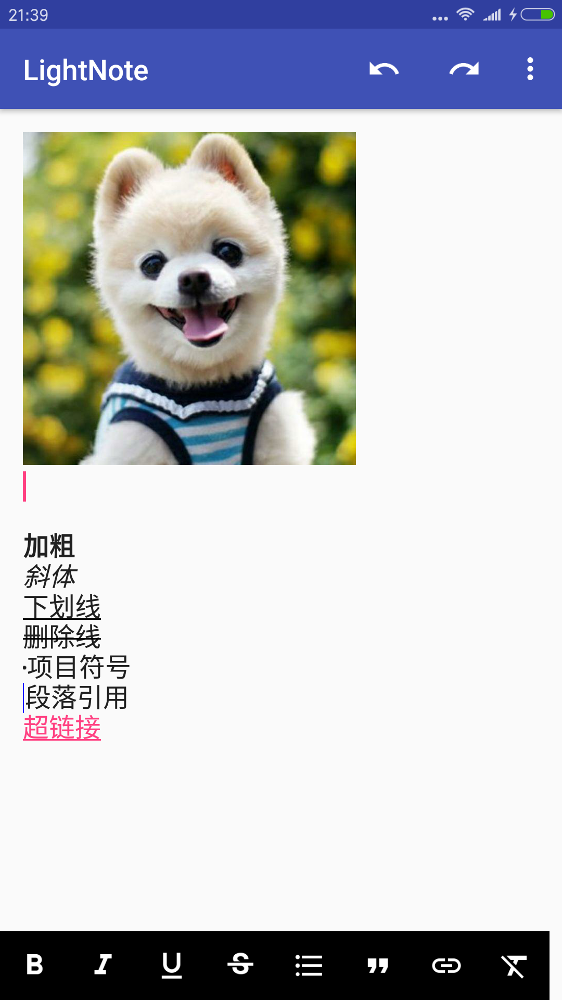

# LightNote
LightNote is an open source Rich Text Editor on the Android,implemented by Span.
##说明
LightNote是一个Android系统上实现的富文本编辑器，借鉴自：https://github.com/mthli/Knife。

区别于Knife,LiteNote主要更新了以下内容：

 - 修复了添加项目符号、段落引用符号时的bug；
 
 - 修复了超链接无法点击的bug；
 
 - 利用泛型精简优化了代码结构,复用了很多代码逻辑；
 
 - 重写了containStyle(Class, int, int, int)，bullet()、quote()等函数、降低了算法复杂度；
 
##V0.1版本
加入了图片的插入功能。

